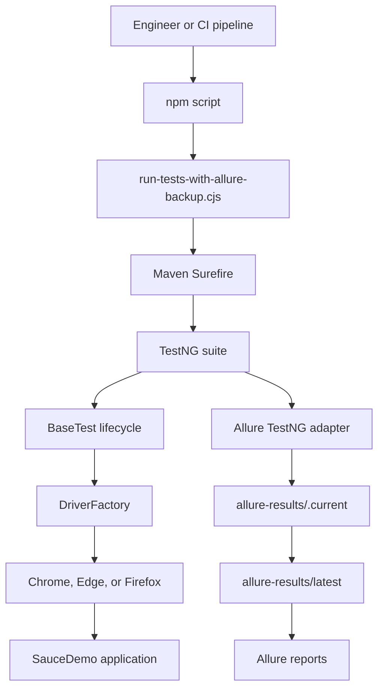
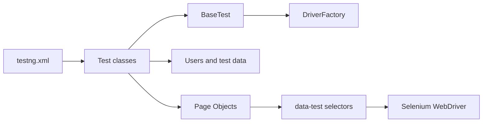
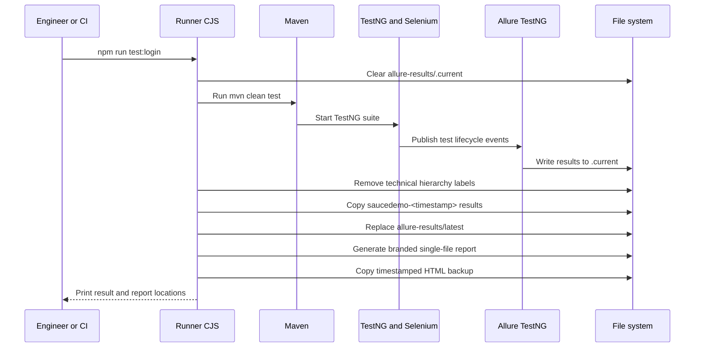

# Selenium SauceDemo

Enterprise-style web automation for the [SauceDemo][2] application, built with Selenium WebDriver, Java 17, TestNG, Maven, and Allure Report.

This project provides a maintainable test architecture and an auditable reporting workflow. Maven remains the Java build and test engine. The npm scripts orchestrate Maven together with Allure result normalization, timestamped backups, branded reports, and local report serving.

## Contents

- [Architecture](#architecture)
- [Prerequisites](#prerequisites)
- [Installation](#installation)
- [Configuration](#configuration)
- [Execution](#execution)
- [Reporting](#reporting)
- [Allure lifecycle](#allure-lifecycle)
- [Test coverage](#test-coverage)
- [Project structure](#project-structure)
- [Engineering standards](#engineering-standards)
- [Troubleshooting](#troubleshooting)

## Architecture



The Java test layer follows the Page Object Model:



## Prerequisites

- Java Development Kit 17 or later
- Maven 3.9 or later
- Node.js 18 or later and npm
- Google Chrome, Microsoft Edge, or Mozilla Firefox
- Git
- Network access to the configured application URL

Selenium Manager downloads and manages the browser driver automatically. A manually configured `chromedriver`, `msedgedriver`, or `geckodriver` path is not required.

## Installation

From the project root, install the report tooling and resolve Java dependencies:

```powershell
npm install
mvn dependency:resolve
```

The Java dependencies are defined in `pom.xml`. The npm dependency provides the Allure command-line tool used by the report scripts.

## Configuration

The default application URL is:

```text
https://www.saucedemo.com
```

Maven properties control the test runtime:

| Property | Default | Purpose |
|---|---|---|
| `baseUrl` | `https://www.saucedemo.com` | Application under test |
| `browser` | `chrome` | Browser: `chrome`, `edge`, or `firefox` |
| `headless` | `true` | Run without a visible browser |
| `retryCount` | `0` | Retry analyzer setting |
| `allure.results.directory` | `target/allure-results` | Java Allure output directory |

Example:

```powershell
mvn clean test -Dtest=LoginTest -DbaseUrl=https://www.saucedemo.com -Dbrowser=chrome -Dheadless=true
```

The `headed` Maven profile sets `headless=false`:

```powershell
mvn clean test -Pheaded
```

The npm runner uses `allure-results/.current` as its active output directory so that it can normalize and archive the results after Maven finishes.

## Execution

### Recommended npm commands

Use npm for normal execution when Allure backups and branded reports are required:

```powershell
npm test
npm run test:login
npm run test:ecommerce
npm run test:validation
npm run test:headed
```

| Command | Scope |
|---|---|
| `npm test` | Complete TestNG suite |
| `npm run test:login` | `LoginTest` |
| `npm run test:ecommerce` | `CheckoutTest` |
| `npm run test:validation` | `UiValidationTest` |
| `npm run test:headed` | Complete suite with a visible browser |

Each npm test command runs Maven, then updates `allure-results/latest` and generates the single-file report when result files exist.

### Direct Maven commands

Use Maven directly when only Java test execution is required:

```powershell
mvn clean test
mvn clean test -Dtest=LoginTest
mvn clean test -Dtest=CheckoutTest
mvn clean test -Dtest=UiValidationTest
mvn clean test -Pheaded
mvn clean test -Dbrowser=firefox
mvn clean test -Dbrowser=edge
mvn clean test -DretryCount=2
```

Direct Maven runs write results to `target/allure-results` and do not perform the npm backup workflow. Use an npm test command when the results must be copied to the repository-level Allure folders.

## Reporting

### Native TestNG and Maven output

Direct Maven execution produces Surefire output in:

```text
target/surefire-reports/
```

This is useful for build diagnostics and machine-readable test status. It is not the branded visual report.

### Allure server report

After a test run, open the latest branded report with:

```powershell
npm run allure:serve
```

The command reads `allure-results/latest`, generates the static report, applies the `GILIGILI` brand and custom icon, starts a local Allure server, and opens the report in a browser. Keep the terminal open while viewing the report and press `Ctrl+C` to stop the server.

### Static Allure report

Generate the static report in `allure-report/`:

```powershell
npm run allure:generate
```

Open the generated report through the project command when needed:

```powershell
npx allure open allure-report
```

### Single-file Allure report

Generate a portable, standalone HTML report:

```powershell
npm run allure:single-file
```

The stable output is:

```text
allure-single-file/saucedemo-latest.html
```

The file can be shared or stored as a build artifact. Server mode is recommended for interactive review because browser security policies can affect reports opened directly through a `file://` URL.

## Allure lifecycle

The npm runner connects Maven execution to the repository-level report artifacts:



The backup format is:

```text
allure-results/saucedemo-ddMMyyyyHHmmss/
allure-single-file/saucedemo-ddMMyyyyHHmmss.html
```

Matching result and HTML backups use the same timestamp, enabling audit, comparison, and artifact retention workflows. Results are preserved when tests fail, provided Allure output was produced before the process ended.

## Branding and evidence

Set the report name in `scripts/report-brand.cjs`:

```javascript
module.exports = {
\tname: 'GILIGILI'
};
```

Place exactly one `.ico` file in `assets/`. The scripts use it for the browser favicon and Allure sidebar icon. Replace that file to change the report branding asset.

Failed tests can attach:

- Failure screenshot
- Failure page source
- Failure URL
- Browser performance logs
- Desktop MP4 recording when headed mode and `ffmpeg` are available

Allure also captures screenshots before and after every test, plus key page transitions such as login, cart, checkout, and order confirmation.

The npm runner removes `JAVA_TOOL_OPTIONS` and `_JAVA_OPTIONS` before launching Maven. This prevents machine-wide Java instrumentation, including Micro Focus UFT hooks, from slowing or blocking the test process.

## Test coverage

| Area | Scenario | Expected outcome |
|---|---|---|
| Authentication | Standard user login | User reaches `/inventory.html` and `Products` is visible |
| Authentication | Locked-out user login | Locked-out error is displayed |
| Commerce | Backpack purchase | Product is added and the order is completed |
| UI validation | Login, inventory, and cart wording | Expected labels and messages are preserved |
| Calculation | Checkout total | Total equals subtotal plus tax |

The TestNG suite is defined in `testng.xml` and includes `LoginTest`, `CheckoutTest`, and `UiValidationTest`.

Test credentials are demo credentials supplied by SauceDemo. Do not reuse this credential pattern for production applications. Production secrets should be supplied through environment variables or a CI secret manager.

## Project structure

```text
selenium-saucedemo/
├── src/test/java/
│   ├── data/Users.java                    # Demo credentials and test data
│   ├── pages/                             # Page Objects
│   ├── support/                           # Driver, lifecycle, and listeners
│   └── tests/                             # TestNG scenarios
├── scripts/
│   ├── run-tests-with-allure-backup.cjs   # Maven runner and backup workflow
│   ├── clean-allure-results.cjs           # Result normalization
│   ├── generate-latest-allure.cjs         # Static report generation
│   ├── generate-latest-allure-single-file.cjs
│   ├── serve-latest-allure.cjs            # Local server workflow
│   ├── report-brand.cjs                   # Report name
│   └── report-assets.cjs                  # Favicon and sidebar icon
├── assets/                                # One custom .ico file
├── allure-results/
│   ├── latest/                            # Latest normalized results
│   └── saucedemo-<timestamp>/             # Historical result backups
├── allure-report/                         # Generated static report
├── allure-single-file/                    # Standalone HTML reports
├── target/                                # Maven and Surefire output
├── pom.xml                                # Java dependencies and Maven config
├── testng.xml                             # TestNG suite definition
└── package.json                           # Report and test orchestration commands
```

## Engineering standards

- Keep browser locators and interactions inside Page Objects.
- Prefer `data-test` selectors over presentation-based CSS selectors.
- Keep tests independent and reset browser state between methods.
- Use explicit waits for meaningful UI state transitions.
- Keep driver creation and teardown in the shared test lifecycle.
- Add Allure steps for business-level actions that matter during review.
- Preserve failure evidence when changing timeout or retry behavior.
- Use `npm run test:login` as a fast smoke check before the complete suite.
- Review `target/surefire-reports` and Allure artifacts when diagnosing failures.

## Troubleshooting

### Maven appears stuck before tests start

Machine-wide Java instrumentation may be injected through `JAVA_TOOL_OPTIONS` or `_JAVA_OPTIONS`. The npm runner removes both variables automatically. For a direct Maven run in PowerShell:

```powershell
Remove-Item Env:JAVA_TOOL_OPTIONS -ErrorAction SilentlyContinue
Remove-Item Env:_JAVA_OPTIONS -ErrorAction SilentlyContinue
mvn clean test -Dtest=LoginTest
```

### Browser driver is unavailable

Confirm the browser is installed and rerun the test. Selenium Manager should download the matching driver automatically.

### Allure latest results are missing

Run a test through the npm runner first:

```powershell
npm run test:login
```

Then serve the report:

```powershell
npm run allure:serve
```

### Single-file report appears blank

Use the server workflow instead of opening the HTML directly:

```powershell
npm run allure:serve
```

### Chrome DevTools Protocol warning appears

The warning means the installed Chrome version is newer than the DevTools implementation bundled with the Selenium version. It does not necessarily fail the test. Upgrade the Selenium dependency when a matching CDP implementation is required.

### Test fails during the SauceDemo flow

Check `baseUrl`, network access, browser version, and the failure evidence in Allure. To isolate the login smoke path:

```powershell
npm run test:login
```

## References

[1]: https://www.selenium.dev/documentation/ "Selenium documentation"
[2]: https://www.saucedemo.com/ "SauceDemo demo application"
[3]: https://allurereport.org/docs/testng/ "Allure TestNG integration documentation"
[4]: https://allurereport.org/docs/commandline/ "Allure Report command-line documentation"